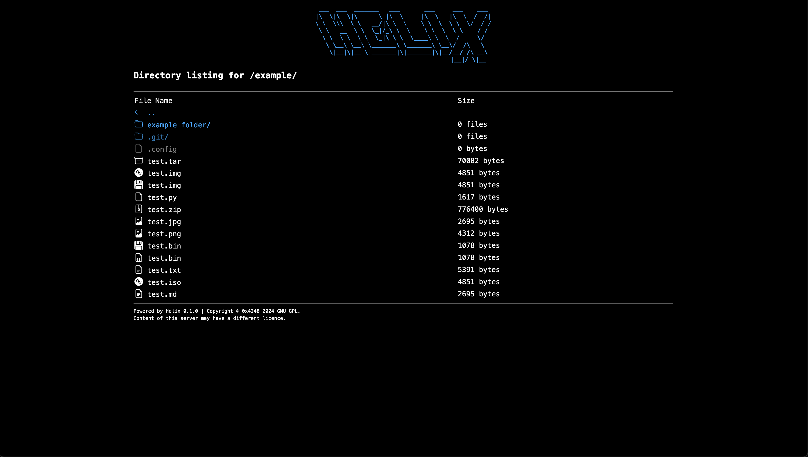

# Helix

A HTTP server that serves static files with a file listing that has support for README files in markdown, HTML, and plain text.



## Installation

You will need to have:

- Python
- Pip
- Make

You will also need the following

```bash
pip install fastapi uvicorn
```

## Usage

To run the server run:

```bash
make
```

## License

This project is licensed under the GNU GPL v3 License - see the [LICENSE](LICENSE) file for details
